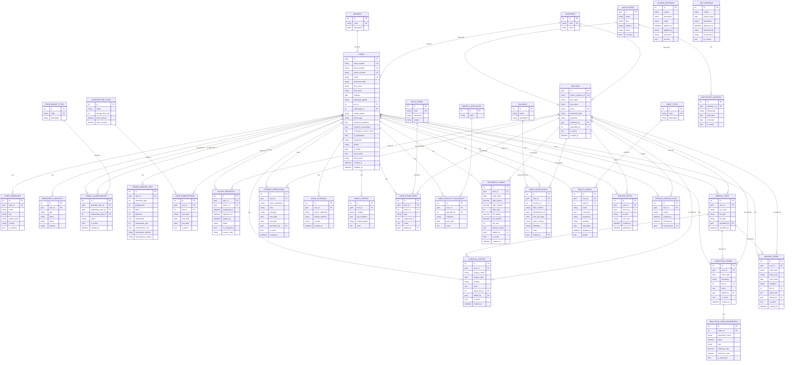

# MediVault — Entity Relationship Diagram

```mermaid
erDiagram

    %% -------------------------------------------------------
    %% REFERENCE TABLES
    %% -------------------------------------------------------

    SUBSCRIPTION_PLANS {
        int id PK
        string name
        int storage_limit_mb
        decimal price_annual
        decimal price_monthly
    }

    INSTITUTIONS {
        guid id PK
        string name
        string type
        string address
        string phone
        bool is_active
    }

    VACCINES {
        int id PK
        string name
        string description
    }

    ICPC2_CODES {
        int id PK
        string code UK
        string description
        string chapter
    }

    MEDICAL_SPECIALTIES {
        int id PK
        string name
    }

    GENDERS {
        int id PK
        string code UK
        string description
    }

    HABIT_TYPES {
        int id PK
        string code UK
        string description
    }

    RELATIONSHIP_TYPES {
        int id PK
        string code UK
        string description
    }

    COUNTRIES {
        int id PK
        string code UK
        string name
    }

    %% -------------------------------------------------------
    %% CORE
    %% -------------------------------------------------------

    USERS {
        guid id PK
        string utent_number UK
        string fiscal_number UK
        string citizen_number UK
        string email UK
        string password_hash
        string first_name
        string last_name
        date birthday
        string biological_gender
        int sex_id FK
        int nationality_id FK
        string marital_status
        string blood_type
        bool accepts_transfusion
        bool accepts_resuscitation
        bool emergency_access_code
        bool is_dependent
        string profession
        string phone
        bool is_active
        bool card_active
        string photo_path
        datetime created_at
        datetime updated_at
    }

    DOCTORS {
        guid id PK
        string ordem_medicos_id UK
        string first_name
        string last_name
        string email UK
        string password_hash
        string speciality
        guid institution_id FK
        int nationality_id FK
        bool is_active
        datetime created_at
    }

    %% -------------------------------------------------------
    %% USER PROFILE
    %% -------------------------------------------------------

    USER_ADDRESSES {
        int id PK
        guid user_id FK
        string street
        string city
        string postal_code
        string country
        bool is_primary
    }

    EMERGENCY_CONTACTS {
        int id PK
        guid user_id FK
        string type
        string name
        string phone
        string address
    }

    %% Guardian/dependent link between two users (KAN-33)
    %% Guardian has full access to the dependent's data (application layer)
    FAMILY_GUARDIANSHIPS {
        int id PK
        guid guardian_user_id FK
        guid dependent_user_id FK
        int relationship_type_id FK
        string status
        bool is_active
        datetime created_at
    }

    FEMALE_MEDICAL_INFO {
        int id PK
        guid user_id FK
        int menarche_age
        int pregnancies
        int births
        int abortions
        bool menopause
        int menopause_age
        bool contraceptive_use
        string intraceptive_method
        string contraceptive_reason
    }

    %% -------------------------------------------------------
    %% SUBSCRIPTIONS & LICENSES
    %% -------------------------------------------------------

    USER_SUBSCRIPTIONS {
        int id PK
        guid user_id FK
        int plan_id FK
        string card_type
        date start_date
        date end_date
        bool is_active
    }

    INSTITUTION_LICENSES {
        int id PK
        guid institution_id FK
        string billing_type
        date start_date
        date end_date
        bool is_active
    }

    %% -------------------------------------------------------
    %% ACCESS CONTROL
    %% Rule: is_emergency = true only allowed when USERS.emergency_access_code = true
    %% (enforced by DB trigger, see schema_*.sql)
    %% -------------------------------------------------------

    ACCESS_REQUESTS {
        int id PK
        guid user_id FK
        guid doctor_id FK
        datetime requested_at
        datetime approved_at
        datetime expires_at
        string status
        bool is_emergency
        string access_code
    }

    %% -------------------------------------------------------
    %% FILES
    %% -------------------------------------------------------

    MEDICAL_FILES {
        int id PK
        guid user_id FK
        string file_name
        string file_type
        string file_path
        guid uploaded_by FK
        datetime uploaded_at
    }

    %% -------------------------------------------------------
    %% MEDICAL HISTORY
    %% -------------------------------------------------------

    SURGICAL_HISTORY {
        int id PK
        guid user_id FK
        string surgery_name
        date surgery_date
        string location
        text notes
        int report_file_id FK
        guid added_by FK
        bool is_active
        datetime created_at
    }

    CHRONIC_MEDICATIONS {
        int id PK
        guid user_id FK
        string active_substance
        string dose
        string posology
        date start_date
        date end_date
        guid prescribed_by FK
        bool is_active
        datetime created_at
    }

    DRUG_ALLERGIES {
        int id PK
        guid user_id FK
        string active_substance
        string allergic_reaction
        string severity
        datetime created_at
    }

    FAMILY_HISTORY {
        int id PK
        guid user_id FK
        string condition
        bool has_condition
        string kinship_degree
        text notes
    }

    USER_PATHOLOGIES {
        int id PK
        guid user_id FK
        int icpc2_id FK
        string type
        date diagnosed_at
        text notes
        guid added_by FK
    }

    USER_SPECIALTY_FOLLOWUPS {
        int id PK
        guid user_id FK
        int specialty_id FK
        string institution
        date start_date
        text notes
    }

    %% -------------------------------------------------------
    %% EXAMS (MCDTS)
    %% -------------------------------------------------------

    ANALYTICAL_EXAMS {
        int id PK
        guid user_id FK
        date exam_date
        string laboratory
        int file_id FK
        text notes
        guid added_by FK
        bool is_active
        datetime created_at
    }

    ANALYTICAL_EXAM_PARAMETERS {
        int id PK
        int exam_id FK
        string parameter_name
        decimal value
        string unit
        decimal reference_min
        decimal reference_max
        bool is_abnormal
    }

    IMAGING_EXAMS {
        int id PK
        guid user_id FK
        string exam_type
        string body_area
        date exam_date
        string institution
        int file_id FK
        text report_text
        guid added_by FK
        bool is_active
        datetime created_at
    }

    OPTOMETRY_EXAMS {
        int id PK
        guid user_id FK
        date exam_date
        decimal right_sphere
        decimal right_cylinder
        int right_axis
        decimal left_sphere
        decimal left_cylinder
        int left_axis
        text disease_report
        guid added_by FK
        bool is_active
        datetime created_at
    }

    %% -------------------------------------------------------
    %% VACCINATIONS
    %% -------------------------------------------------------

    USER_VACCINATIONS {
        int id PK
        guid user_id FK
        int vaccine_id FK
        string dose_number
        date administered_at
        date next_due_date
        string batch_number
        string institution
        text notes
        guid added_by FK
    }

    %% -------------------------------------------------------
    %% HEALTH HABITS (consolidated)
    %% details JSON: type-specific fields
    %% -------------------------------------------------------

    HEALTH_HABITS {
        int id PK
        guid user_id FK
        int type_id FK
        string name
        bool consumes
        string frequency
        string quantity
        date start_date
        datetime updated_at
        json details
    }

    %% -------------------------------------------------------
    %% DOCTOR NOTES & FLAGS
    %% -------------------------------------------------------

    DOCTOR_NOTES {
        int id PK
        guid user_id FK
        guid doctor_id FK
        string section
        binary note_text
        datetime created_at
        datetime updated_at
    }

    PENDING_REVIEW_FLAGS {
        int id PK
        guid user_id FK
        string section
        datetime created_at
        datetime reviewed_at
        guid reviewed_by FK
    }

    %% -------------------------------------------------------
    %% RELATIONSHIPS
    %% -------------------------------------------------------

    %% Institutions & Doctors
    INSTITUTIONS                ||--|{ DOCTORS                    : "employs"
    INSTITUTIONS                ||--o{ INSTITUTION_LICENSES       : "has"
    COUNTRIES                   ||--o{ DOCTORS                    : "nationality"

    %% Users — profile
    GENDERS                     ||--o{ USERS                      : "classifies"
    COUNTRIES                   ||--o{ USERS                      : "nationality"
    USERS                       ||--o{ USER_ADDRESSES             : "has"
    USERS                       ||--o{ EMERGENCY_CONTACTS         : "has"
    USERS                       ||--o{ FAMILY_GUARDIANSHIPS       : "is guardian in"
    USERS                       ||--o{ FAMILY_GUARDIANSHIPS       : "is dependent in"
    RELATIONSHIP_TYPES          ||--o{ FAMILY_GUARDIANSHIPS       : "classifies"
    USERS                       ||--o| FEMALE_MEDICAL_INFO        : "has"

    %% Users — subscriptions & access
    SUBSCRIPTION_PLANS          ||--o{ USER_SUBSCRIPTIONS         : "defines"
    USERS                       ||--o{ USER_SUBSCRIPTIONS         : "subscribes"
    USERS                       ||--o{ ACCESS_REQUESTS            : "receives"
    DOCTORS                     ||--o{ ACCESS_REQUESTS            : "requests"

    %% Users — files
    USERS                       ||--o{ MEDICAL_FILES              : "owns"
    DOCTORS                     ||--o{ MEDICAL_FILES              : "uploads"

    %% Users — medical history
    USERS                       ||--o{ SURGICAL_HISTORY           : "has"
    MEDICAL_FILES               ||--o{ SURGICAL_HISTORY           : "attached to"
    DOCTORS                     ||--o{ SURGICAL_HISTORY           : "recorded by"

    USERS                       ||--o{ CHRONIC_MEDICATIONS        : "takes"
    DOCTORS                     ||--o{ CHRONIC_MEDICATIONS        : "prescribed by"

    USERS                       ||--o{ DRUG_ALLERGIES             : "has"
    USERS                       ||--o{ FAMILY_HISTORY             : "has"

    USERS                       ||--o{ USER_PATHOLOGIES           : "has"
    ICPC2_CODES                 ||--o{ USER_PATHOLOGIES           : "classifies"
    DOCTORS                     ||--o{ USER_PATHOLOGIES           : "recorded by"

    USERS                       ||--o{ USER_SPECIALTY_FOLLOWUPS   : "has"
    MEDICAL_SPECIALTIES         ||--o{ USER_SPECIALTY_FOLLOWUPS   : "in"

    %% Users — exams
    USERS                       ||--o{ ANALYTICAL_EXAMS           : "has"
    MEDICAL_FILES               ||--o{ ANALYTICAL_EXAMS           : "attached to"
    DOCTORS                     ||--o{ ANALYTICAL_EXAMS           : "recorded by"
    ANALYTICAL_EXAMS            ||--|{ ANALYTICAL_EXAM_PARAMETERS : "has"

    USERS                       ||--o{ IMAGING_EXAMS              : "has"
    MEDICAL_FILES               ||--o{ IMAGING_EXAMS              : "attached to"
    DOCTORS                     ||--o{ IMAGING_EXAMS              : "recorded by"

    USERS                       ||--o{ OPTOMETRY_EXAMS            : "has"
    DOCTORS                     ||--o{ OPTOMETRY_EXAMS            : "recorded by"

    %% Users — vaccinations
    VACCINES                    ||--o{ USER_VACCINATIONS          : "administered as"
    USERS                       ||--o{ USER_VACCINATIONS          : "has"
    DOCTORS                     ||--o{ USER_VACCINATIONS          : "recorded by"

    %% Users — habits
    USERS                       ||--o{ HEALTH_HABITS              : "has"
    HABIT_TYPES                 ||--o{ HEALTH_HABITS              : "classifies"

    %% Doctor notes & flags
    USERS                       ||--o{ DOCTOR_NOTES               : "subject of"
    DOCTORS                     ||--o{ DOCTOR_NOTES               : "writes"
    USERS                       ||--o{ PENDING_REVIEW_FLAGS       : "has"
    DOCTORS                     ||--o{ PENDING_REVIEW_FLAGS       : "reviews"

    %% -------------------------------------------------------
    %% VERSIONING (no FK relations — standalone tables)
    %% -------------------------------------------------------

    SCHEMA_VERSIONS {
        int id PK
        string version
        string description
        string script
        datetime applied_at
        string applied_by
        string checksum
        bool success
    }

    APP_VERSIONS {
        int id PK
        string version
        date release_date
        string description
        datetime deployed_at
        string deployed_by
        string environment
        bool is_current
    }
```
